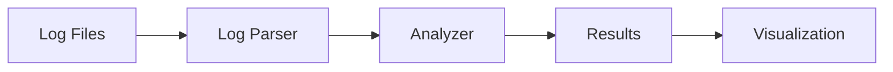

# Log Insight Architecture

## System Overview

Log Insight is built with a modular architecture that separates concerns and allows for easy extension and modification.

### Core Components

1. **Log Parser (`src/data/log_parser.py`)**
   - Handles log file reading and parsing
   - Supports multiple log formats
   - Provides streaming capabilities
   - Responsible for initial log structuring

2. **Analyzers (`src/analyzers/`)**
   - Base analyzer interface
   - LLM-powered analyzer implementation
   - Traditional pattern-based analyzer
   - Extensible for custom analyzers

3. **Visualization (`src/visualization/`)**
   - Chart generation
   - Real-time dashboard updates
   - Export capabilities

### Data Flow



## Component Details

### Log Parser
- Chunks logs for efficient processing
- Extracts timestamps, log levels, and messages
- Validates log format
- Handles different timestamp formats

### LLM Analyzer
- Connects to OpenAI API
- Processes log chunks
- Extracts insights and patterns
- Generates recommendations

### Visualization
- Creates interactive charts
- Shows temporal patterns
- Displays issue distribution
- Highlights critical events

## Extension Points

1. **Custom Analyzers**
```python
from src.analyzers.base import BaseAnalyzer

class CustomAnalyzer(BaseAnalyzer):
    def analyze_chunk(self, logs):
        # Custom analysis logic
        pass
```

2. **New Log Formats**
```python
# Add new timestamp patterns to LogParser
self.timestamp_patterns.append(r'your_pattern_here')
```

3. **Visualization Extensions**
```python
# Add new chart types to visualization module
def create_custom_chart(data):
    # Custom visualization logic
    pass
```

## Performance Considerations

- Log chunking for memory efficiency
- Async processing capabilities
- Caching of analysis results
- Batch processing of logs

## Security

- API key management
- Log data handling
- Error handling and logging
- Input validation

## Future Enhancements

1. Real-time log streaming support
2. Additional ML models integration
3. Custom rule engine
4. Advanced visualization features
5. Export capabilities